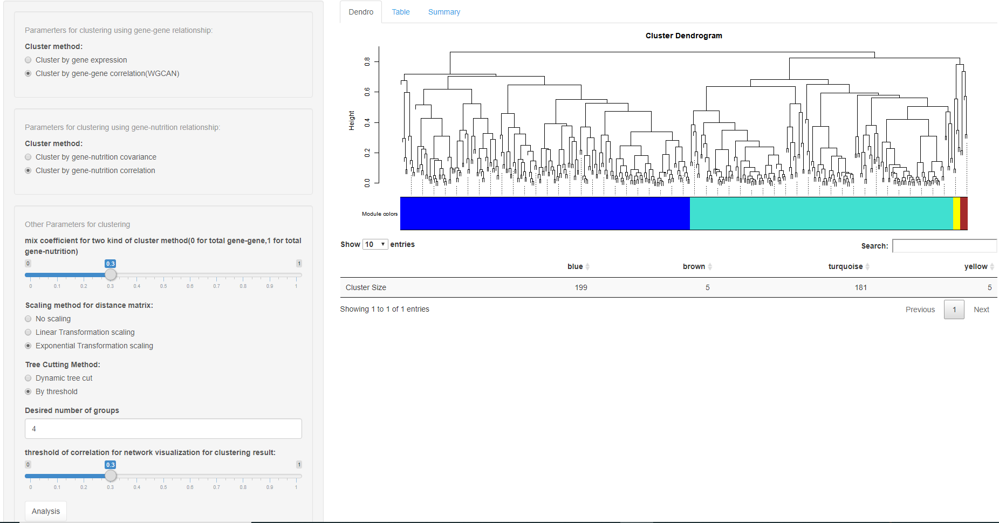
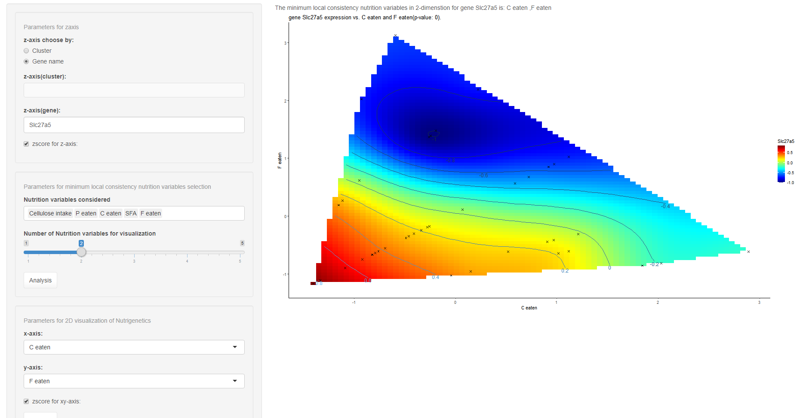

# LC-N2G: A Local Consistency Approach for Nutrigenomics Data Analysis

> This shiny app LC-N2G explores the relationship between nutrition and its corresponding gene expression data.

Shiny app(LC-N2G) explores the relationship between nutrition and its corresponding gene expression data. The default dataset comes from the mouse nutrition study (GSE85998)[1]. The overall workflow of LC-N2G is as follows and for a full description, we refer to [our paper](Our-paper).
	

	
<div align=center>
	
Figure 1 Overall workflow of LC-N2G. Matrix G anf N represent the input matrix of gene and nutrition information, respectively. In the first step we calculate the Local consistency statistics (LC-Stat) of combinations with a gene of interest and find combinations of nutrients with small LC-Stat. Then the LC-Test is performed to evaluate the relationship between combination of nutrients with gene. Finally the Nutrition Geometry Framework (NGF)[2] is performed for the selected combination and genes.

</div>

## Get Started

To use this shiny app you can either:

 - visit our webpage http://shiny.maths.usyd.edu.au/LC-N2G/ , or
 
 - install it through
 
	``` r
	remotes::install_github("SydneyBioX/LCN2G")
	library(LCN2G)
	run_App()
	```
	
## Packages Requirements

- shinythemes ≥ 1.1.2
- shinyjs ≥ 1.1
- DT ≥ 0.13
- directlabels ≥ 2020.1.31
- GA ≥ 3.2
- tidyverse ≥ 1.3.0
- visNetwork ≥ 2.0.9
- dynamicTreeCut ≥ 1.63-1
- fields ≥ 10.3
- reshape2 ≥ 1.4.3
- ggdendro ≥ 0.1-20
- gridExtra ≥ 2.3


 
## Usage	

This shiny app has three parts: Data Preprocessing, Gene Clustering and Visualization. We introduce each part as follows.

### Data Preprocessing

This part preprocesses the gene and nutrition data. 
 

	
We have implemented different preprocessing methods. Either upload a dataset (in csv format, each row represents a sample) or otherwise the default data set can be used (no upload needed) by clicking Analysis (GSE85998). Different threshold for filtering is provided and the resulting plot will appear in the right panel after clicking on analysis.

In the default dataset, we already normalised using Cyclophilin as the endogenous control, so just use "None" as the normalization method.

### Gene Clustering

In order to get representitive genes for the second visualization step, we provide a gene cluster method. If some special gene expressions are of interest, this step can be skipped.

	
	
The clustering method we use here is hierachical clustering; the choice of the distance matrix can be varied. The first panel provides a clustering method for gene-gene relationships and the distance matrix can be based on gene expression or on gene-gene correlation. Also the gene-nutrition relationship can be used to cluster either based on the covariance or the correlation matrix. A hybrid parameter is used to combine the matrices.

To use a single matrix, set this parameter to either 0 or 1. Cuttree is an alternative method.

The output panel visualizes the dendrogram for clustering and the corresponding result is shown in the tabel tab-panel. A network of nutrition, clusters and its corresponding eigen-gene is presented in summary tab-panel.
	
### Gene Nutrition Visualization

Finally, the Nutrition Geometry Framework (NGF) [2] is done in this part.
	

	
The first parameter here is used for the chosen gene ("gene name") or cluster of genes ("cluster"). If "gene name" is chosen, the result is the NGF of the gene input in "z-axis(gene):". If "cluster" is chosen, the NGFs of four representitive features (mean, variance, eigen-gene and a presentitive gene) of the cluster selected in "z-axis(cluster):" is shown.

For the LC-Test of the relationship between selected gene/cluster, the candidate nutrition variables can be chosen in the second panel. Click analysis in this panel, the combination with smallest LC-Statistic will show in the output panel.

The final parameters are used to visualize the NGF with selected x-axis and y-axis. Output panel will show the resulting NGF.

## Our paper

Xu, X.N., Solon-Biet, S.M. et al: LC-N2G: A Local Consistency Approach for Nutrigenomics Data Analysis. (Submitted to BMC Bioinformatics) 

## Reference

[1] Solon-Biet, S.M., Cogger, V.C. et al: Defining the nutritional and metabolic context of fgf21 using the geometric framework. Cell Metabolism 24, 555–565 (2016)

[2] Raubenheimer, D., Simpson, S.J.: Nutritional ecology and human health. Annual Review of Nutrition 36, 603–626 (2016)


## Contact us
If you have any enquiries, especially about performing LC-N2G on your own data, then please contact xiangnan.xu@sydney.edu.au. You can also raise an issue on [GitHub](https://github.com/SydneyBioX/LCN2G/).
